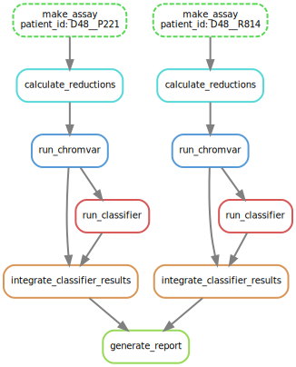

# Standard Operating Procedure

## Background and Rationale

### What's and Why's

This workflow was created to automate the process of analysing single-cell assays of transpose-accessible chromatin sequencing (scATAC-seq) data and running an under-development cell type machine learning classifier on the outputs. A `snakemake` workflow was used to serve as a reproducible, "self-documenting" pipeline that will be relied upon to process future incoming data that will be generated in the same way as these pilot samples.

### Aim

The aim of this workflow is to **pre-process and label single-cell ATAC-seq libraries** by putative blood cell lineage and export this classification into a **convenient R serialized data object** that is ready for downstream analysis.

### Package Dependencies

This pipeline depends on system, R, and python packages. The installation instructions for each are presented separately under [Usage](#usage).

#### System

* `pandoc`

#### R

* `R >= 4.1.0`
* `BiocManager >= 3.14`
* `tidyverse`
* `DT`
* `Seurat`
* `Signac`
* `motifmatchr`
* `chromVAR`
* `chromVARmotifs`
* `EnsDb.Hsapiens.v75`
* `BSgenome.Hsapiens.UCSC.hg19`

#### Python

* `python >= 3`
* `snakemake`
* `joblib`
* `pandas`
* `scikit-learn`
* `lightgbm`

## Usage

### 0. Installation of system dependencies

A number of system libraries and dependencies are required for proper library function. Depending on your operating system, the installation procedure will vary. Below are links to installation documentation for the required dependencies.

* [`pandoc`](https://pandoc.org/installing.html)

### 1. Installation of `conda` and Python dependencies

`conda` is required to create a clean execution environment for the pipeline. Instructions to install `conda` can be found [here depending on your OS](https://conda.io/projects/conda/en/latest/user-guide/install/index.html).

We will now generate an environment for snakemake and install the necessary dependencies.

```
$ conda create -c bioconda -c conda-forge -n snakemake snakemake joblib pandas scikit-learn lightgbm
$ conda activate snakemake
```

### 2. Installation of R dependencies

R can be installed by following the instructions [here](https://rstudio-education.github.io/hopr/starting.html) which are an excerpt from "*Hands-On Programming with R*" by Garrett Grolemund. While RStudio is not required for the execution of this pipeline, downstream data exploration will be easier in the IDE.

After R is installed, in a command line, enter an interactive R session:

```
$ R
```

From here, we will use the built-in package manager to install some basic libraries as well as `BiocManager` which will give us access to the Bioconductor world of bioinformatics packages.

```
>>> install.packages(c('tidyverse', 'DT', 'devtools', 'BiocManager'))
>>> BiocManager::install(c('motifmatchr', 'Seurat', 'Signac', 'chromVAR', 'EnsDb.Hsapiens.v75', 'BSgenome.Hsapiens.UCSC.hg19'))
```

Finally, we need to install a dataset that is available only on github by the Greenleaf group using the `devtools` library.

```
>>> devtools::install_github("GreenleafLab/chromVARmotifs")
```

You can now exit the R prompt.

```
>>> quit()
```

### 3. Cloning pipeline

Now that all the dependencies have been acquired, this repository needs to be downloaded to a working directory on your local computer.

```
$ cd /your/working/directory
$ git clone https://github.com/ddtam/atac-pipe.git
$ cd atac-pipe
```

### 4. Uploading data and generating metadata

Within this working directory, the data to be analysed should be placed within `data/` **in individual directories with the _same identifiers_ as in the sample metadata file.** The sample metadata file is a simple `.tsv` formatted file that should be placed at `data/metadata.tsv`.

Example contents of the metadata sample manifest:

```
library_id	treatment_response
D48__P221	responder
D48__R814	nonresponder
D48__R923	nonresponder
D48__Z177	responder
```

The first column of the metadata must be a unique library identifier that corresponds to a directory within `data/samples/` that houses the necessary 10X `cellranger` exports as defined in ["Input"](#input).

Later columns can be used to store other sample metadata as desired that are pertinent to your own downstream analyses.

### 5. Pipeline execution

Once dependencies have been acquired, the pipeline has been downloaded locally and loaded with your data, the pipeline is ready to be run. From the root of your working directory, execute `snakemake`.

```
$ snakemake --cores 4
```

This will run `snakemake` on 4 cores for parallel processing of the 4 sample datasets that are included in this repository. You may wish to increase or decrease parallelization based on the volume of your data and available computational resources.

### Workflow Overview

Example execution order for 2 input samples.



## Input

This pipeline is intended to be executed on the output of [10X's `cellranger` pipeline](https://support.10xgenomics.com/single-cell-gene-expression/software/pipelines/latest/what-is-cell-ranger), which processes the raw reads of an ATAC-seq experiment into quantified peaks.

Three files are required from this output:
* `filtered_peak_bc_matrix.h5`
* `singlecell.csv`
* `fragments.tsv.gz`

For each library that should be put through the pipeline, a directory should be created within `data/samples/` that contains these three files. It is important that the _name_ of these directories match the library identifiers within the sample metadata file (`data/metadata.tsv`) as this will serve as the execution manifest when the pipeline looks for your files.

An example directory structure for the [metadata in "Usage"](#3-uploading-data-and-generating-metadata) above:
```
samples
├── D48__P221
│   ├── filtered_peak_bc_matrix.h5
│   ├── fragments.tsv.gz
│   └── singlecell.csv
├── D48__R814
│   ├── filtered_peak_bc_matrix.h5
│   ├── fragments.tsv.gz
│   └── singlecell.csv
├── D48__R923
│   ├── filtered_peak_bc_matrix.h5
│   ├── fragments.tsv.gz
│   └── singlecell.csv
└── D48__Z177
    ├── filtered_peak_bc_matrix.h5
    ├── fragments.tsv.gz
    └── singlecell.csv

```
⚠️ **NOTE:** due to this data being sensitive, the files above are present but empty. The first step of the pipeline has been executed (summarised in DAG) and the intermediary files have been significantly downsampled so as to anonymize the data and improve testing speed. **The pipeline is executable as-is from the intermediate output of `make_assay` in `cache/samples/*_seurat_obj.rds`.**

## Output

All final outputs from this pipeline can be found within `final/`.

The main results of this pipeline are (1) a preliminary `.html` report summarizing the classification results and (2) the `seurat` data objects stored as `.rds` files which can be conveniently imported in later analyses.

```
final
├── D48__P221
│   └── D48__P221_seurat_w_classification.rds
├── D48__R814
│   └── D48__R814_seurat_w_classification.rds
├── D48__R923
│   └── D48__R923_seurat_w_classification.rds
├── D48__Z177
│   └── D48__Z177_seurat_w_classification.rds
└── summary_report.html
```